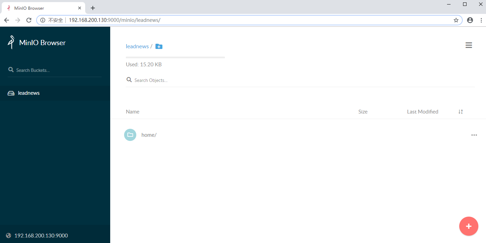
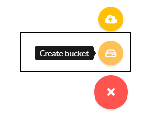
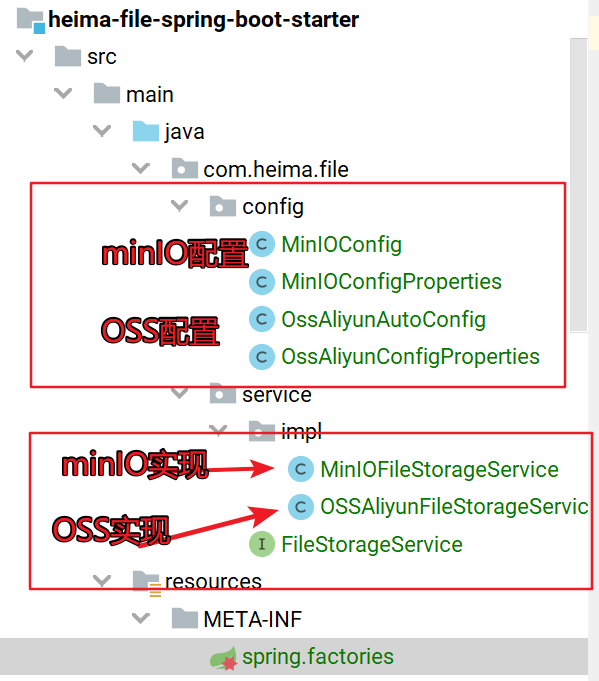

## 对象存储服务MinIO 

### 1 MinIO简介

MinIO基于Apache License v2.0开源协议的对象存储服务，可以做为云存储的解决方案用来保存海量的图片，视频，文档。由于采用Golang实现，服务端可以工作在Windows,Linux, OS X和FreeBSD上。配置简单，基本是复制可执行程序，单行命令可以运行起来。

MinIO兼容亚马逊S3云存储服务接口，非常适合于存储大容量非结构化的数据，例如图片、视频、日志文件、备份数据和容器/虚拟机镜像等，而一个对象文件可以是任意大小，从几kb到最大5T不等。

**S3 （ Simple Storage Service简单存储服务）**

基本概念

- bucket – 类比于文件系统的目录
- Object – 类比文件系统的文件
- Keys – 类比文件名

官网文档：http://docs.minio.org.cn/docs/

### 2 MinIO特点 

- 数据保护

  Minio使用Minio Erasure Code（纠删码）来防止硬件故障。即便损坏一半以上的driver，但是仍然可以从中恢复。

- 高性能

  作为高性能对象存储，在标准硬件条件下它能达到55GB/s的读、35GB/s的写速率

- 可扩容

  不同MinIO集群可以组成联邦，并形成一个全局的命名空间，并跨越多个数据中心

- SDK支持

  基于Minio轻量的特点，它得到类似Java、Python或Go等语言的sdk支持

- 有操作页面

  面向用户友好的简单操作界面，非常方便的管理Bucket及里面的文件资源

- 功能简单

  这一设计原则让MinIO不容易出错、更快启动

- 丰富的API

  支持文件资源的分享连接及分享链接的过期策略、存储桶操作、文件列表访问及文件上传下载的基本功能等。

- 文件变化主动通知

  存储桶（Bucket）如果发生改变,比如上传对象和删除对象，可以使用存储桶事件通知机制进行监控，并通过以下方式发布出去:AMQP、MQTT、Elasticsearch、Redis、NATS、MySQL、Kafka、Webhooks等。


### 3 开箱使用 

#### 3.1 安装启动   

我们提供的镜像中已经有minio的环境

我们可以使用docker进行环境部署和启动

```yaml
docker pull minio/minio:RELEASE.2021-06-14T01-29-23Z


docker run -p 9090:9000 --name minio -d --restart=always -e "MINIO_ACCESS_KEY=minio" -e "MINIO_SECRET_KEY=minio123" -v /home/data:/data -v /home/config:/root/.minio minio/minio:RELEASE.2021-06-14T01-29-23Z server /data
```

#### 3.2 管理控制台   

假设我们的服务器地址为http://192.168.200.130:9090，我们在地址栏输入：http://http://192.168.200.130:9090/ 即可进入登录界面。


Access Key为minio   Secret_key 为minio123    进入系统后可以看到主界面



点击右下角的“+”号 ，点击下面的图标，创建一个桶




### 4 封装MinIO为starter

#### 4.1 改造heima-file-spring-boot-starter模块

新增依赖

```xml
<dependency>
        <groupId>io.minio</groupId>
        <artifactId>minio</artifactId>
        <version>7.1.0</version>
</dependency>
```

#### 4.2 替换配置

拷贝资料 中 **config** 及 **service**文件夹，  替换原有文件




#### 4.3 加入自动配置

在resources中新建`META-INF/spring.factories`

```properties
org.springframework.boot.autoconfigure.EnableAutoConfiguration=\
 com.heima.file.service.impl.OSSAliyunFileStorageService,com.heima.file.service.impl.MinIOFileStorageService
```

#### 4.4 其他微服务使用

第一，导入heima-file-spring-boot-starter的依赖

第二，在配置中心 `share-file.yml ` 中添加minio所需要的配置

```yaml
#OSS配置
file:
  oss:
    bucket-name: <!-- 存储空间 -->
    access-key-id: <!-- OSS密钥key -->
    access-key-secret: <!-- OSS密钥 -->
    endpoint: oss-cn-shanghai.aliyuncs.com
    web-site: <!-- OSS访问前缀 -->
    proxy-username: aliyun-sdk-java
    socket-timeout: 10000
    idle-connection-time: 10000
    connection-request-timeout: 4000
    max-connections: 2048
    max-error-retry: 5
    white-list: 127.0.0.1
    connection-timeout: 10000
    prefix: material
# minIO配置
  minio:
    accessKey: minio
    secretKey: minio123
    bucket: hmtt137
    endpoint: http://${spring.profiles.ip}:9090/
    readPath: http://${spring.profiles.ip}:9090/
    prefix: article
```

第三，在对应使用的业务类中注入FileStorageService，样例如下：

```java
package com.heima.wemedia;
import com.heima.file.service.FileStorageService;
import org.junit.Test;
import org.junit.runner.RunWith;
import org.springframework.beans.factory.annotation.Autowired;
import org.springframework.boot.test.context.SpringBootTest;
import org.springframework.test.context.junit4.SpringRunner;
import javax.annotation.Resource;
import java.io.FileInputStream;
import java.io.FileNotFoundException;

@SpringBootTest
@RunWith(SpringRunner.class)
public class MinIoTest {
    // 指定MinIo实现
    @Resource(name = "minIOFileStorageService")
    FileStorageService fileStorageService;
    // 不指定 beanName 注入的是OSS的实现
    @Autowired
    FileStorageService fileStorageService2;
    @Test
    public void uploadToMinIo() throws FileNotFoundException {
        System.out.println(fileStorageService);
        System.out.println(fileStorageService2);
        // 准备好一个静态页
        FileInputStream fileInputStream = new FileInputStream("D://list.html");
        // 将静态页上传到minIO文件服务器中          文件名称            文件类型             文件流
        fileStorageService.store("aa","list.html","text/html",fileInputStream);
    }
}
```

